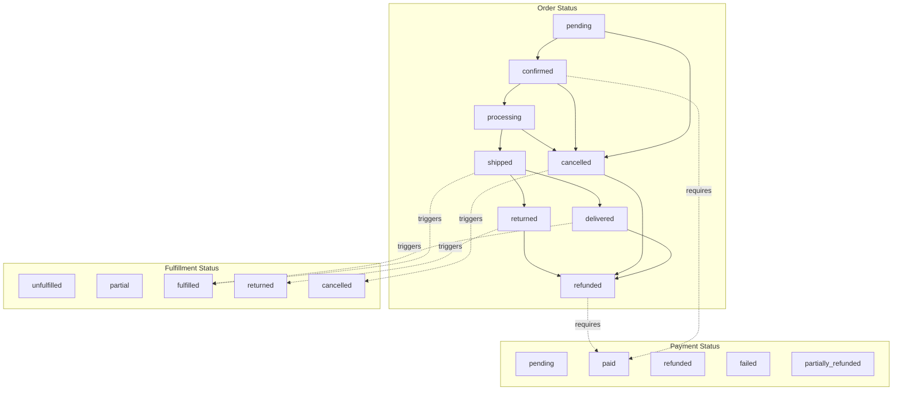
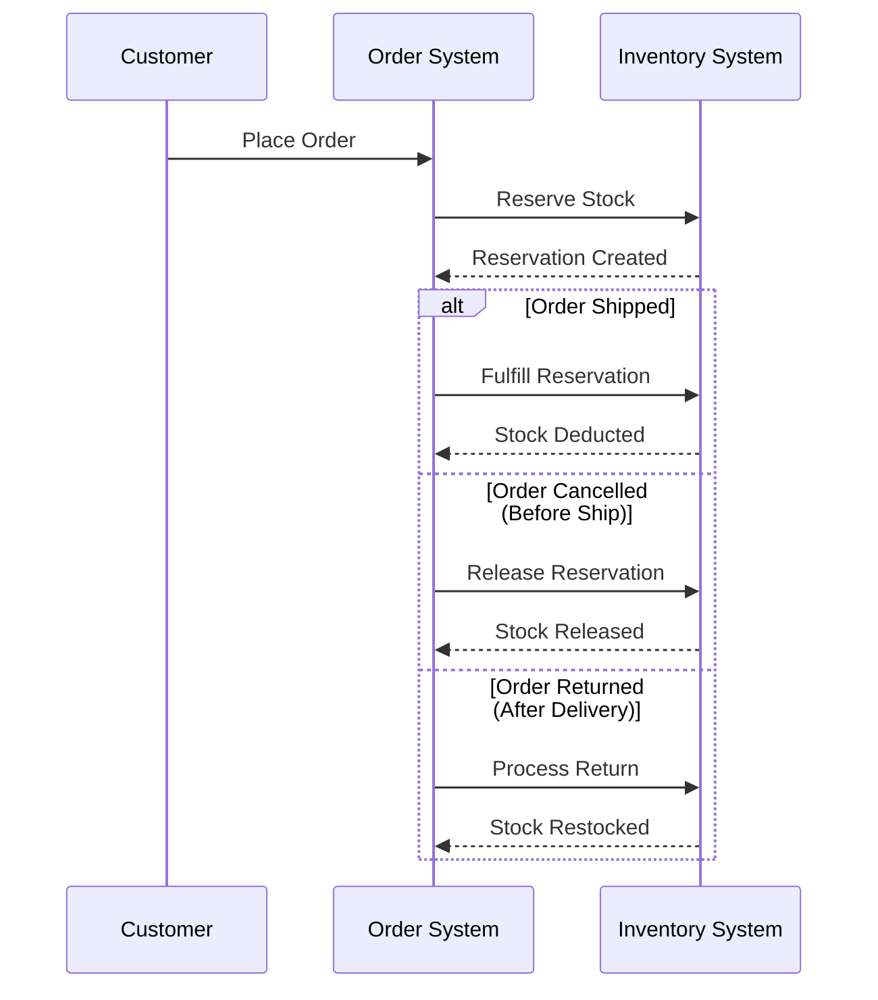

# Order Status Management Rules - Complete Documentation

> **Document Purpose**: Comprehensive documentation of the interdependent order status management system covering Order Status, Payment Status, and Fulfillment Status with all possible scenarios and test cases.

---

## Table of Contents
1. [Status Definitions](#1-status-definitions)
2. [Status Interdependencies](#2-status-interdependencies)
3. [State Transition Rules](#3-state-transition-rules)
4. [Business Rule Matrix](#4-business-rule-matrix)
5. [Test Scenarios](#5-test-scenarios)
6. [Inventory Impact](#6-inventory-impact)
7. [API Reference](#7-api-reference)

---

## 1. Status Definitions

### 1.1 Order Status
The primary lifecycle status of an order.

| Status | Description | Typical Duration |
|--------|-------------|------------------|
| `pending` | Order created, awaiting confirmation/payment | 0-24 hours |
| `confirmed` | Payment received or COD approved | 1-2 days |
| `processing` | Order being prepared/packed | 1-3 days |
| `shipped` | Order dispatched with carrier | 2-7 days |
| `delivered` | Order successfully delivered | Terminal |
| `cancelled` | Order cancelled before delivery | Terminal |
| `refunded` | Money returned to customer | Terminal |
| `returned` | Item returned after delivery | Pre-terminal |

### 1.2 Payment Status
Tracks the financial state of the order.

| Status | Description |
|--------|-------------|
| `pending` | Awaiting payment |
| `paid` | Full payment received |
| `refunded` | Full refund issued |
| `failed` | Payment attempt failed |
| `partially_refunded` | Partial refund issued |

### 1.3 Fulfillment Status
Tracks the physical fulfillment of the order.

| Status | Description |
|--------|-------------|
| `unfulfilled` | Items not yet dispatched |
| `partial` | Some items dispatched |
| `fulfilled` | All items dispatched/delivered |
| `returned` | Items returned to warehouse |
| `cancelled` | Fulfillment cancelled |

---

## 2. Status Interdependencies

### 2.1 Dependency Diagram



### 2.2 Core Interdependency Rules

| Rule ID | When | Then | Condition |
|---------|------|------|-----------|
| **R1** | Order → `confirmed` | Payment should be `paid` | For prepaid orders |
| **R2** | Order → `shipped` | Fulfillment → `fulfilled` | If unfulfilled |
| **R3** | Order → `delivered` | Fulfillment → `fulfilled` + Set `delivery_date` | Always |
| **R4** | Order → `cancelled` | Fulfillment → `cancelled` | Always |
| **R5** | Order → `returned` | Fulfillment → `returned` | Always |
| **R6** | Order → `refunded` | Payment must have been `paid` | Always |
| **R7** | Order → `shipped` | Tracking number required | Always |
| **R8** | Fulfillment → `fulfilled` | Deduct inventory | If not already fulfilled |

---

## 3. State Transition Rules

### 3.1 Order Status Transitions

```
┌─────────────────────────────────────────────────────────────────────┐
│                     ORDER STATUS STATE MACHINE                       │
├─────────────────────────────────────────────────────────────────────┤
│                                                                     │
│   ┌─────────┐     ┌───────────┐     ┌────────────┐     ┌─────────┐ │
│   │ pending │────▶│ confirmed │────▶│ processing │────▶│ shipped │ │
│   └────┬────┘     └─────┬─────┘     └──────┬─────┘     └────┬────┘ │
│        │                │                   │                │      │
│        │                │                   │                ▼      │
│        │                │                   │          ┌───────────┐│
│        │                │                   │          │ delivered ││
│        │                │                   │          └─────┬─────┘│
│        │                │                   │                │      │
│        ▼                ▼                   ▼                │      │
│   ┌───────────────────────────────────────────┐              │      │
│   │               cancelled                   │◀─────────────┘      │
│   └────────────────────┬──────────────────────┘    (via returned)   │
│                        │                                            │
│                        ▼                                            │
│                   ┌──────────┐     ┌──────────┐                     │
│                   │ refunded │◀────│ returned │                     │
│                   └──────────┘     └──────────┘                     │
│                                                                     │
└─────────────────────────────────────────────────────────────────────┘
```

### 3.2 Valid Order Transitions Table

| Current Status | Allowed Next Status | Blocked Transitions |
|----------------|---------------------|---------------------|
| `pending` | `confirmed`, `cancelled` | processing, shipped, delivered, refunded, returned |
| `confirmed` | `processing`, `cancelled` | pending, shipped, delivered, refunded, returned |
| `processing` | `shipped`, `cancelled` | pending, confirmed, delivered, refunded, returned |
| `shipped` | `delivered`, `returned` | pending, confirmed, processing, cancelled, refunded |
| `delivered` | `refunded` | pending, confirmed, processing, shipped, cancelled, returned |
| `cancelled` | `refunded` | pending, confirmed, processing, shipped, delivered, returned |
| `refunded` | *(Terminal - None)* | All |
| `returned` | `refunded` | pending, confirmed, processing, shipped, delivered, cancelled |

### 3.3 Payment Status Transition Rules

| Current Status | Allowed Next Status | Business Rule |
|----------------|---------------------|---------------|
| `pending` | `paid`, `failed` | Normal payment flow |
| `paid` | `refunded`, `partially_refunded` | Only after successful payment |
| `failed` | `pending`, `paid` | Retry payment |
| `refunded` | *(Terminal)* | Cannot unrefund |
| `partially_refunded` | `refunded` | Complete the refund |

### 3.4 Fulfillment Status Transition Rules

| Current Status | Allowed Next Status | Auto-Triggered By |
|----------------|---------------------|-------------------|
| `unfulfilled` | `partial`, `fulfilled`, `cancelled` | — |
| `partial` | `fulfilled`, `cancelled` | — |
| `fulfilled` | `returned` | Order → delivered |
| `returned` | — | Order → returned |
| `cancelled` | — | Order → cancelled |

---

## 4. Business Rule Matrix

### 4.1 Automatic Status Updates

When an admin changes one status, the system may automatically update related statuses:

| Action | Order Status | Payment Status | Fulfillment Status | Inventory Action |
|--------|--------------|----------------|-------------------|------------------|
| Confirm Order | `pending` → `confirmed` | — | — | — |
| Process Order | `confirmed` → `processing` | — | — | — |
| Ship Order | `processing` → `shipped` | — | `unfulfilled` → `fulfilled` | Fulfill reservation |
| Mark Delivered | `shipped` → `delivered` | — | → `fulfilled` | — |
| Cancel (before ship) | → `cancelled` | — | → `cancelled` | Release reservation |
| Cancel (after ship) | Not allowed | — | — | — |
| Return Order | `shipped/delivered` → `returned` | — | → `returned` | Restock inventory |
| Refund Order | → `refunded` | `paid` → `refunded` | — | — |
| Mark as Paid | — | `pending` → `paid` | — | — |
| Fulfill Manually | — | — | → `fulfilled` | Deduct stock |

### 4.2 Validation Rules

> [!IMPORTANT]
> These validation rules MUST be enforced before any status change:

| Rule | Validation | Error Message |
|------|------------|---------------|
| **V1** | Cannot ship without tracking number | "Tracking number is required when marking an order as Shipped." |
| **V2** | Cannot refund if not paid | "Cannot mark as Refunded if the order was never Paid." |
| **V3** | Cannot cancel shipped orders | "Cannot cancel order in 'shipped' status." |
| **V4** | Cannot skip status steps | "Cannot change status from 'X' to 'Y'. Allowed: [list]" |
| **V5** | Cannot change terminal status | "Order is in terminal state 'refunded'." |

### 4.3 COD (Cash on Delivery) Special Rules

| Scenario | Order Status Flow | Payment Status |
|----------|-------------------|----------------|
| COD Order Created | `pending` | `pending` |
| COD Order Confirmed | `pending` → `confirmed` | `pending` (remains) |
| COD Order Shipped | `confirmed` → `shipped` | `pending` (remains) |
| COD Payment Collected | `shipped` | `pending` → `paid` |
| COD Delivered | `shipped` → `delivered` | `paid` |

---

## 5. Test Scenarios

### 5.1 Happy Path Scenarios

#### TC-001: Standard Prepaid Order Flow
```
Initial State:
  - Order Status: pending
  - Payment Status: pending
  - Fulfillment Status: unfulfilled

Steps:
  1. Customer pays online → Payment: pending → paid
  2. Admin confirms order → Order: pending → confirmed
  3. Admin processes order → Order: confirmed → processing
  4. Admin ships with tracking → Order: processing → shipped, Fulfillment: → fulfilled
  5. Carrier delivers → Order: shipped → delivered

Expected Final State:
  - Order Status: delivered
  - Payment Status: paid
  - Fulfillment Status: fulfilled
```

#### TC-002: COD Order Flow
```
Initial State:
  - Order Status: pending, Payment: pending, Fulfillment: unfulfilled
  - Payment Method: COD

Steps:
  1. Admin confirms COD order → Order: pending → confirmed
  2. Admin processes → Order: confirmed → processing
  3. Admin ships → Order: processing → shipped, Fulfillment: → fulfilled
  4. Delivery agent collects cash → Payment: pending → paid
  5. Order marked delivered → Order: shipped → delivered

Expected Final State:
  - Order Status: delivered
  - Payment Status: paid
  - Fulfillment Status: fulfilled
```

### 5.2 Cancellation Scenarios

#### TC-003: Cancel Pending Order
```
Initial State:
  - Order: pending, Payment: pending, Fulfillment: unfulfilled

Action: Admin cancels order

Expected:
  - Order Status: cancelled
  - Fulfillment Status: cancelled
  - Inventory: Reservation released ✓
```

#### TC-004: Cancel Confirmed Order (Paid)
```
Initial State:
  - Order: confirmed, Payment: paid, Fulfillment: unfulfilled

Action: Admin cancels order

Expected:
  - Order Status: cancelled
  - Fulfillment Status: cancelled
  - Inventory: Reservation released ✓
  - Note: Refund can be initiated separately
```

#### TC-005: Cancel Processing Order
```
Initial State:
  - Order: processing, Payment: paid, Fulfillment: unfulfilled

Action: Admin cancels order

Expected:
  - Order Status: cancelled
  - Fulfillment Status: cancelled
  - Inventory: Reservation released ✓
```

#### TC-006: Attempt Cancel Shipped Order (BLOCKED)
```
Initial State:
  - Order: shipped, Payment: paid, Fulfillment: fulfilled

Action: Admin attempts to cancel

Expected:
  - ERROR: "Cannot change status from 'shipped' to 'cancelled'"
  - Admin must use Return flow instead
```

### 5.3 Return & Refund Scenarios

#### TC-007: Return After Delivery
```
Initial State:
  - Order: delivered, Payment: paid, Fulfillment: fulfilled

Steps:
  1. Customer requests return
  2. Admin marks order as returned → Order: delivered → returned, Fulfillment: → returned
  3. Inventory is restocked
  4. Admin processes refund → Order: returned → refunded, Payment: paid → refunded

Expected Final State:
  - Order Status: refunded
  - Payment Status: refunded
  - Fulfillment Status: returned
  - Inventory: Restocked ✓
```

#### TC-008: Refund Cancelled Order (Paid)
```
Initial State:
  - Order: cancelled, Payment: paid, Fulfillment: cancelled

Action: Admin refunds the payment

Expected:
  - Order Status: refunded
  - Payment Status: refunded
```

#### TC-009: Attempt Refund Unpaid Order (BLOCKED)
```
Initial State:
  - Order: cancelled, Payment: pending, Fulfillment: cancelled

Action: Admin attempts to mark as refunded

Expected:
  - ERROR: "Cannot mark as Refunded if the order was never Paid."
```

### 5.4 Shipping Validation Scenarios

#### TC-010: Ship Without Tracking (BLOCKED)
```
Initial State:
  - Order: processing, Tracking: null

Action: Admin attempts to mark as shipped without tracking

Expected:
  - ERROR: "Tracking number is required when marking an order as Shipped."
```

#### TC-011: Ship With Tracking
```
Initial State:
  - Order: processing, Tracking: null

Action: Admin provides tracking "TRACK123" and ships

Expected:
  - Order Status: shipped ✓
  - Fulfillment Status: fulfilled ✓
  - Tracking Number: TRACK123 ✓
  - Inventory: Reservation fulfilled ✓
```

### 5.5 Edge Case Scenarios

#### TC-012: Multiple Status Update Attempt
```
Action: Try to update Order, Payment, Fulfillment simultaneously

Expected:
  - Each status validated independently
  - Cross-dependencies enforced
  - All updates in single transaction (atomicity)
```

#### TC-013: Skip Status (BLOCKED)
```
Initial State:
  - Order: pending

Action: Admin attempts to mark as shipped directly

Expected:
  - ERROR: "Cannot change status from 'pending' to 'shipped'. Allowed: confirmed, cancelled"
```

#### TC-014: Customer Self-Cancel
```
Initial State:
  - Order: pending OR confirmed

Action: Customer cancels via frontend

Expected:
  - Order Status: cancelled
  - Fulfillment Status: cancelled
  - Inventory: Released ✓
  - Note: Only allowed for pending/confirmed status
```

#### TC-015: Customer Self-Cancel Processing (BLOCKED)
```
Initial State:
  - Order: processing

Action: Customer attempts to cancel

Expected:
  - ERROR: "Cannot cancel order in 'processing' status. Only pending or confirmed orders can be cancelled."
```

### 5.6 Payment Status Scenarios

#### TC-016: Mark Paid Before Confirmation
```
Initial State:
  - Order: pending, Payment: pending

Action: Admin marks payment as paid

Expected:
  - Payment Status: paid ✓
  - paid_at timestamp set ✓
  - Order status unchanged (still pending)
```

#### TC-017: Payment Failed Retry
```
Initial State:
  - Order: pending, Payment: failed

Action: Customer retries payment successfully

Expected:
  - Payment Status: paid ✓
  - paid_at timestamp set ✓
```

#### TC-018: Partial Refund
```
Initial State:
  - Order: delivered, Payment: paid

Action: Admin issues partial refund

Expected:
  - Payment Status: partially_refunded ✓
  - Order status unchanged
```

### 5.7 Fulfillment Status Scenarios

#### TC-019: Manual Fulfillment
```
Initial State:
  - Order: confirmed, Fulfillment: unfulfilled

Action: Admin manually marks fulfillment as fulfilled

Expected:
  - Fulfillment Status: fulfilled ✓
  - Inventory: Stock deducted ✓
  - fulfillment_date set ✓
```

#### TC-020: Partial Fulfillment
```
Initial State:
  - Order: processing, Fulfillment: unfulfilled
  - Items: 3 products

Action: Admin ships 2 of 3 items

Expected:
  - Fulfillment Status: partial ✓
  - Inventory: Partial deduction ✓
```

---

## 6. Inventory Impact

### 6.1 Inventory Actions by Status Change

| Status Change | Inventory Action | Function Called |
|---------------|------------------|-----------------|
| Order Created | Reserve stock | `createReservation()` |
| Order → Shipped | Fulfill reservation (deduct stock) | `fulfillOrderInventory()` |
| Order → Cancelled (unfulfilled) | Release reservation | `releaseReservation()` |
| Order → Returned | Restock items | `processOrderReturn()` |
| Fulfillment → Fulfilled (manual) | Deduct stock | `fulfillOrderInventory()` |

### 6.2 Inventory Timing Rules



---

## 7. API Reference

### 7.1 Update Order Status
```
PUT /api/admin/orders/:id/status

Request Body:
{
  "order_status": "shipped",          // Optional
  "payment_status": "paid",           // Optional
  "fulfillment_status": "fulfilled",  // Optional
  "order_tracking": "TRACK123",       // Required if shipping
  "admin_comment": "Shipped via BlueDart"  // Optional
}

Validations Applied:
- Status transition validation
- Tracking number requirement for shipped
- Payment validation for refunded
```

### 7.2 Update Payment Status
```
PUT /api/admin/orders/:id/payment

Request Body:
{
  "payment_status": "paid",
  "paid_at": "2026-01-31T10:00:00Z",  // Optional, defaults to now
  "transaction_id": "TXN123",         // Optional
  "payment_ref": "PAY_REF_456",       // Optional
  "notes": "Payment confirmed via bank transfer"  // Optional
}
```

### 7.3 Update Fulfillment Status
```
PUT /api/admin/orders/:id/fulfillment

Request Body:
{
  "fulfillment_status": "fulfilled",
  "fulfillment_date": "2026-01-31",   // Optional
  "delivery_date": "2026-02-03",      // Optional
  "tracking_number": "TRACK123",      // Optional
  "notes": "Shipped complete"         // Optional
}

Side Effects:
- If fulfilled: Triggers inventory deduction
```

### 7.4 Cancel Order (User)
```
POST /api/orders/:id/cancel

Request Body:
{
  "reason": "Changed my mind"  // Optional
}

Validations:
- Only owner can cancel
- Only pending/confirmed orders can be cancelled
```

---

## Summary

This document defines the complete order status management system with:

- **3 Status Types**: Order, Payment, Fulfillment
- **8 Order Statuses**: pending → confirmed → processing → shipped → delivered
- **5 Payment Statuses**: pending, paid, refunded, failed, partially_refunded
- **5 Fulfillment Statuses**: unfulfilled, partial, fulfilled, returned, cancelled
- **20+ Test Scenarios** covering happy paths, errors, and edge cases
- **5 Validation Rules** preventing invalid transitions
- **Inventory Integration** for stock management

> [!TIP]
> When implementing status changes, always check:
> 1. Is the transition allowed?
> 2. Are all prerequisites met (tracking, payment)?
> 3. What automatic side effects should trigger?
> 4. What inventory actions are needed?
